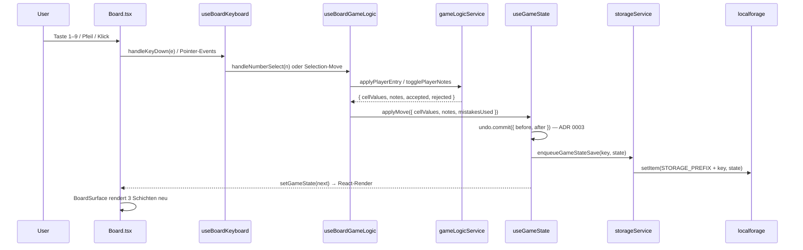
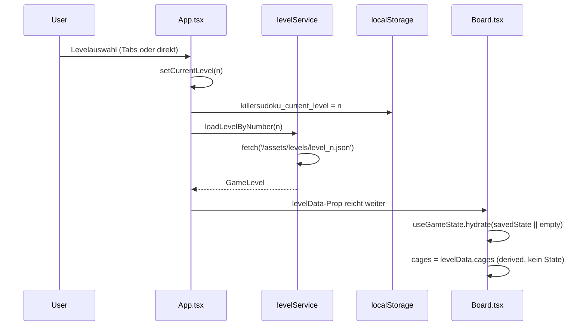
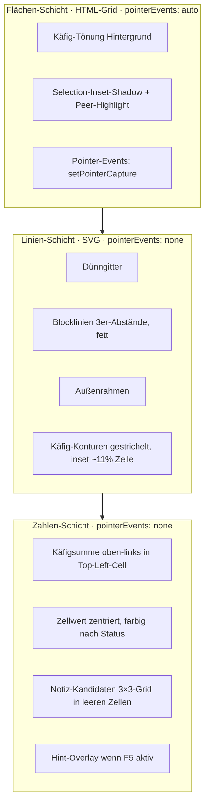

# Architektur — Killer Sudoku

Überblick für Entwickler:innen und Agenten. Soll reichen, um eine neue
Funktion an der richtigen Stelle zu verankern, ohne die ganze Codebasis zu
lesen.

## Tech-Stack-Schichten

```
┌─────────────────────────────────────────────────────────────────┐
│  Browser (Chrome, Safari, Firefox, mobile Webkit)               │
│  ┌───────────────────────────────────────────────────────────┐  │
│  │  Service Worker (vite-plugin-pwa, Workbox)                 │  │
│  │  Precache: js, css, html, json, png, ico, svg             │  │
│  └───────────────────────────────────────────────────────────┘  │
│  ┌───────────────────────────────────────────────────────────┐  │
│  │  React 18 (Chakra UI v2, framer-motion, Emotion 11)       │  │
│  │  ┌──────────────────────────────────────────────────────┐  │  │
│  │  │  App.tsx  (Layout, Tab-Routing, PWA-Install-Prompt)  │  │  │
│  │  │  ├─ Tabs.tsx (HomeTab, LevelsTab)                    │  │  │
│  │  │  └─ components/common (Help, Tutorial, Install)       │  │  │
│  │  │                                                      │  │  │
│  │  │  Board.tsx  (Hook-Orchestrator)                      │  │  │
│  │  │  └─ BoardSurface.tsx  (3-Schicht-Renderer, pur)      │  │  │
│  │  │                                                      │  │  │
│  │  │  LevelSelector, NumberPad, HomeActions               │  │  │
│  │  └──────────────────────────────────────────────────────┘  │  │
│  │  ┌──────────────────────────────────────────────────────┐  │  │
│  │  │  Hooks (useGameState, useBoardGameLogic,             │  │  │
│  │  │          useCellSelection, useBoardKeyboard,         │  │  │
│  │  │          useUndoRedo, useBoardResize,                │  │  │
│  │  │          useCellAnimation, useHints, useTutorial)    │  │  │
│  │  └──────────────────────────────────────────────────────┘  │  │
│  │  ┌──────────────────────────────────────────────────────┐  │  │
│  │  │  Services (storageService, levelService,             │  │  │
│  │  │             gameLogicService, board, hintEngine,     │  │  │
│  │  │             progressService, statisticsService,      │  │  │
│  │  │             puzzleGeneratorService)                  │  │  │
│  │  └──────────────────────────────────────────────────────┘  │  │
│  │  ┌──────────────────────────────────────────────────────┐  │  │
│  │  │  Utils (pure): killerConstraints, killerCombinations,│  │  │
│  │  │          killerRegions, killerSolver, formatDuration,│  │  │
│  │  │          levelValidator                              │  │  │
│  │  └──────────────────────────────────────────────────────┘  │  │
│  │  Types (gameTypes.ts — Domain-Source-of-Truth)             │  │
│  └───────────────────────────────────────────────────────────┘  │
│  Persistenz: localforage (IndexedDB), localStorage (kleine Flags)│
└─────────────────────────────────────────────────────────────────┘
```

Keine Backend-Tier. Keine API. Keine Datenbank außerhalb des Browsers.

## Datenfluss: Spielzug



## Datenfluss: Level-Wechsel



## Render-Schichten (ADR 0001)

Das Brett ist **drei gestapelte Layer**, jeder mit einer Aufgabe:



**Stacking-Reihenfolge ist hart**: Flächen (unten) → Linien (Mitte) → Zahlen
(oben). Jede Schicht steht im `BoardSurface.tsx`. Layer-Reihenfolge umdrehen =
Werte verschwinden hinter Gittern oder Klicks laufen ins Leere.

`cageOutlinePath()` in `src/components/Board/cageOutline.ts` baut die
gestrichelten Inset-Konturen. Erwartet: Zell-Liste + `cellSize` + `insetPx`
+ `radiusPx`. Statisch pro Level, keine React-State.

## Zustands-Layer

| Layer | Eigentümer | Lifetime | Persistenz |
|---|---|---|---|
| `GameState` (Werte, Notizen, Counter) | `useGameState` | Session + Reload | localforage (IndexedDB) |
| `pencilMode` | `Board.tsx` (lokal) | Session | – (Issue #4) |
| Selection | `useCellSelection` | Drag-Pointer | – |
| History (Undo/Redo) | `useUndoRedo` | Session | – |
| `blackAndWhiteMode` | `App.tsx` | Persistent | localStorage |
| `currentLevel` | `App.tsx` | Persistent | localStorage |
| `solvedLevels`, `startedLevels` | `progressService` | Persistent | localStorage |

**Regel**: UI-State (Selection, Pencil-Mode) ist getrennt von Game-State
(`cellValues`, `notes`). Niemals mischen — siehe `AGENTS.md` §5.3.

## Hook-Composition-Graph

`Board.tsx` ist ein Orchestrator. Es instanziiert:

```
useGameState(puzzleId, size)       ← Lade + Save + Undo/Redo
useCellSelection(cages, cellSize)   ← Pointer-Drag, Anker, Rect-Selection
useCellAnimation()                  ← Pulse/Success/Error-Keyframes
useHints()                          ← F5 Hint-Overlay
useBoardResize(...)                 ← Cell-Größe ans Layout anpassen
useBoardGameLogic({...})            ← handleNumberSelect, Clear, Reset, RevealHint
useBoardKeyboard({...})             ← Pfeile/WASD/Tab/Ziffern/Backspace
useStrategicHint()                  ← H-Tast → Toast
useKeyboardShortcuts({...})         ← window-Listener (App-weit)
useUndoRedo<GameState>()            ← Stacks
```

Jeder Hook hat ko-lokalen Test (`.test.ts[x]`).

## Build- und Bundle-Layout

`vite.config.ts` definiert manuelle Chunks:

- `vendor.ui` — React, Chakra, Emotion, framer-motion
- `vendor.storage` — localforage
- App-Code (Default)

Hintergrund: Vendor ändert sich selten → bleibt im Browser-Cache warm.
React + Chakra + framer-motion wurden wegen Zirkelimport-Risikos in einen
einzigen Vendor-Chunk zusammengezogen (siehe `vite.config.ts` Kommentarblock
im Bundle-Split-Abschnitt).

## Was diese Architektur NICHT hat

- **Kein Server-Side-Rendering.** Pure SPA.
- **Keine Authentifizierung.** Kein User-Account. Kein Backend.
- **Keine Telemetrie.** Keine Analytics-SDKs, keine externen Tracker.
- **Keine Build-Time-Datenbankanbindung.** Level-JSONs sind statische Assets.
- **Keine Push-Notifications.** PWA-`autoUpdate`-Modus, ohne `injectManifest`.

## Was sich daraus für neue Features ergibt

| Idee | Konsequenz |
|---|---|
| Online-Multiplayer | Backend + Auth nötig — größere Architektur-Änderung, ADR |
| Cloud-Save | Sync-Layer über existierendes localforage — mittlere Änderung |
| Neue Puzzle-Variante | Generator-Service erweitern, neue Level-JSONs, kein UI-Umbau |
| Neuer Hint-Typ | `hintEngine.ts` + Toast-Branch in `Board.tsx` |
| Neuer Modus (z. B. „Daily Challenge") | Tab in `Tabs.tsx`, neuer Hook, ADR |