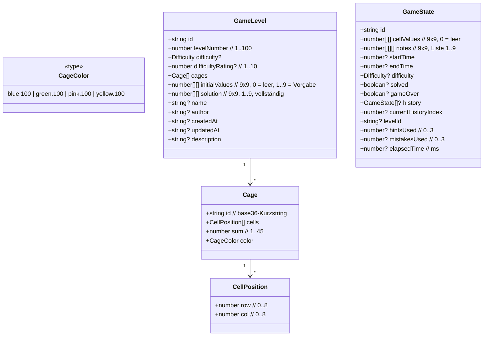

# Datenmodell — Killer Sudoku

Single Source of Truth für die Formen, die durch das Repo fließen.
Level-JSONs, Runtime-State, Persistenz.

## Domain-Typen (`src/types/gameTypes.ts`)



### Wichtige Invarianten

- **`CellPosition.row, .col`** sind beide `0..8`. `row` zuerst, überall.
- **`Cage.cells`** enthält mindestens eine Zelle, höchstens 9. Zellen sind
  orthogonal zusammenhängend (kein diagonales Cage).
- **`Cage.sum`** = Σ `solution[cell.row][cell.col]` für alle `cell in cells`.
  Wird bei der Level-Erzeugung aus der Lösung berechnet, nicht eingegeben.
- **`Cage.color`** ∈ {`blue.100`, `green.100`, `pink.100`, `yellow.100`}.
  Vier-Farben-Palette gemäß Vier-Farben-Theorem für planare Käfig-Graphen.
- **`GameLevel.initialValues`** und **`GameLevel.solution`** sind beide
  `9×9 number[][]`. `initialValues` enthält die Vorgaben (`1..9` an
  vorgegebenen Stellen, sonst `0`). `solution` ist die vollständige gültige
  Sudoku-Lösung (`1..9` überall, alle Sudoku-Regeln erfüllt, alle
  Käfig-Summen erreichen `cage.sum`).
- **`difficulty`** ist im aktuellen Datensatz **nicht** gesetzt. Die App leitet
  die Schwierigkeit aus der Levelnummer ab (Phase-1-Heuristik im
  `LevelSelector`). Phase-2-Kandidat: ersetzen durch echte Pro-Brett-Berechnung.

### Cell-Wert-Konvention

- `0` = leere Zelle, `1..9` = gesetzte Ziffer. Niemals `null` oder `undefined`
  in `cellValues` / `initialValues` / `solution`.
- `cellValues` darf `initialValues` an Vorgabe-Positionen überschreiben —
  `sanitizePlayerBoard` stellt beim Laden sicher, dass Vorgaben zurück-
  geschrieben werden.

## Level-JSON-Format (`public/assets/levels/level_<n>.json`)

```jsonc
{
  "id": "level-1",
  "levelNumber": 1,
  // "difficulty": "easy",            ← aktuell NICHT gesetzt
  "name": "Erste Schritte",
  "author": "oliver",
  "createdAt": "2025-12-20T00:00:00Z",
  "updatedAt": "2025-12-20T00:00:00Z",
  "description": "Einstiegs-Level mit großen Käfigen.",
  "cages": [
    {
      "id": "k1",
      "cells": [ { "row": 0, "col": 0 }, { "row": 0, "col": 1 } ],
      "sum": 7,
      "color": "blue.100"
    }
    // ... 30–45 Cages pro Level
  ],
  "initialValues": [
    [1, 0, 0, 0, 0, 0, 0, 0, 0],
    [0, 0, 0, 0, 0, 0, 0, 0, 0]
    // 9x9
  ],
  "solution": [
    [1, 2, 3, 4, 5, 6, 7, 8, 9]
    // 9x9, vollständig
  ]
}
```

### Validierung beim Laden

`utils/levelValidator.ts` prüft beim Laden:

1. `cages` vollständig (jede Zelle in genau einem Käfig).
2. `sum` je Käfig == Σ `solution` der Käfigzellen.
3. Käfigzellen orthogonal zusammenhängend (kein Diagonal-Cage).
4. `initialValues` widerspricht nicht `solution` an Vorgabe-Positionen.
5. `solution` ist gültiges Sudoku (Zeile/Spalte/Block).
6. **Eindeutigkeit**: Killer-Sudoku-Solver in `utils/killerSolver.ts` muss
   genau eine Lösung finden.

Test-Suite: `npm run lint:levels` führt `levelValidator.test.ts` über alle
100 Levels aus. Pflicht nach jeder Änderung an Levels oder am Validator.

### Einerkäfig-Quote

ADR 0002 cappt die Anzahl trivialer Einerkäfigs pro Schwierigkeit. Konkret:

- Die Quote ist `|Einerkäfig| / |Cages|`, nicht bezogen auf Zellen — Käfigs
  sind die Bezugsgröße, weil ein Einerkäfig trivial ist.
- Bei Überschreitung greift die **Pool-Härtung**: drei Pools mit steigender
  Härte werden probiert; der letzte Pool hat keine Käfig-Größe `1`.
- Caps pro Schwierigkeit stehen in ADR 0002.

## GameState zur Laufzeit (`src/hooks/useGameState.ts`)

`GameState` ist die einzige veränderliche Runtime-Struktur. Sie wird:

- **hydriert** aus localforage (per `puzzleId`) oder leer erzeugt.
- **mutiert** ausschließlich über `applyMove` (Board-Mutation) oder
  `updateGameState` (Metadaten).
- **persistiert** durch `enqueueGameStateSave` (serialisiert pro Key,
  siehe [`docs/STORAGE.md`](./STORAGE.md)).

### `notes` vs. Solver-`candidates`

Zwei strikt getrennte Konzepte, oft verwechselt:

| Begriff | Quelle | Persistenz | Sichtbar? |
|---|---|---|---|
| Player Pencil Mark (`notes`) | Spieler, Bleistiftmodus | ja (GameState) | ja, im Brett-Overlay |
| Solver-`candidates` | `hintEngine.ts`, `killerConstraints.ts` | nein | nein (intern) |

Das Vokabular in User-Strings folgt strikt `CONTEXT.md`: "Notiz-Kandidat" für
Spieler-Notizen, "mögliche Werte" für Solver-Output.

## Cell-Key-String

`"${row},${col}"` — der String-Key für Maps und Sets, die Cell→Cage abbilden.
Verwendung:

- `Map<string, Cage>` in `services/board.ts` (`buildCageIndex`).
- `Set<string>` in `cageOutline.ts` für die Membership-Prüfung.

**Nicht** inline bauen. `cellKey(cell)` aus `services/board.ts` benutzen.

## Eindeutigkeit

Was im Domain-Modell **eindeutig** ist:

- `(row, col)` identifiziert eine Cell.
- `puzzleId` identifiziert einen Spielstand (üblich: `"level-3"`,
  `"generated-<uuid>"` für Zufalls-Levels).
- `cage.id` identifiziert einen Käfig innerhalb eines Levels.

Was **nicht** eindeutig ist:

- `Cage` zwischen Levels (kein globaler Namespace).
- `GameState.id` — die ID enthält schon `puzzleId` plus Timestamp, ist aber
  nicht semantisch eindeutig. Dient als Storage-Key-Suffix.